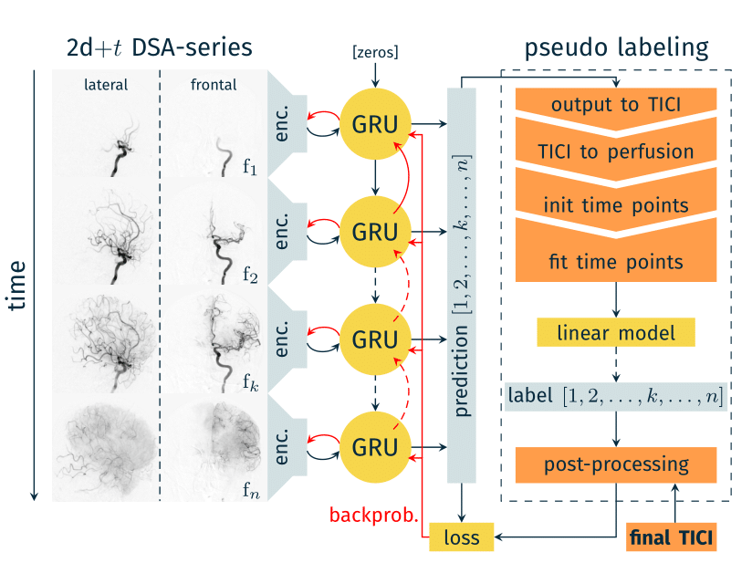

# ColabMed: Automated TICI Scoring with DL

This repository is a fork of https://github.com/IPMI-ICNS-UKE/DeepTICI.

I have streamlined the source code, enabling it for the prediction of Thrombolysis in Cerebral Infarction (TICI) scores for a given Digital Subtraction Angiography (DSA) series with two views (i.e., lateral and frontal), accounting for the original M1 occlusion.

## Requirements
**All** you need is a Google account with access to Colaboratory.

## Installation
**No** coding expertise is required, and there's **no** need for manual software installation on your part.

## Usage
Simply follow the video demonstration to input the DSA sequence and obtain your TICI score. The only consideration is to ensure that the 'ImageType' in the Dicom file properties you enter contains the keywords 'BIPLANE A' and 'BIPLANE B' for clear differentiation between lateral and frontal views.

## Discussion
This is the original paper along with the corresponding flowchart:

[Deep Learning–Based Automated Thrombolysis in Cerebral Infarction Scoring: A Timely Proof-of-Principle Study](https://doi.org/10.1161/STROKEAHA.120.033807)

While adopting a time-based classification is indeed a sensible approach, I am inclined to believe that the contributions of f1, f2, fn in the plot may not exert a substantial impact on the scores, at least not to the extent observed with the contribution of fk.

For seasoned clinicians, do you find it plausible to derive a TICI score solely from fk (or including fk-1, fk, fk+1)? This simplification could hold profound consequences for AI models.

Your insights and contributions to the open-source code are highly valued. Please feel free to share your ideas.

**Kindly refrain from utilizing it for commercial purposes.**
